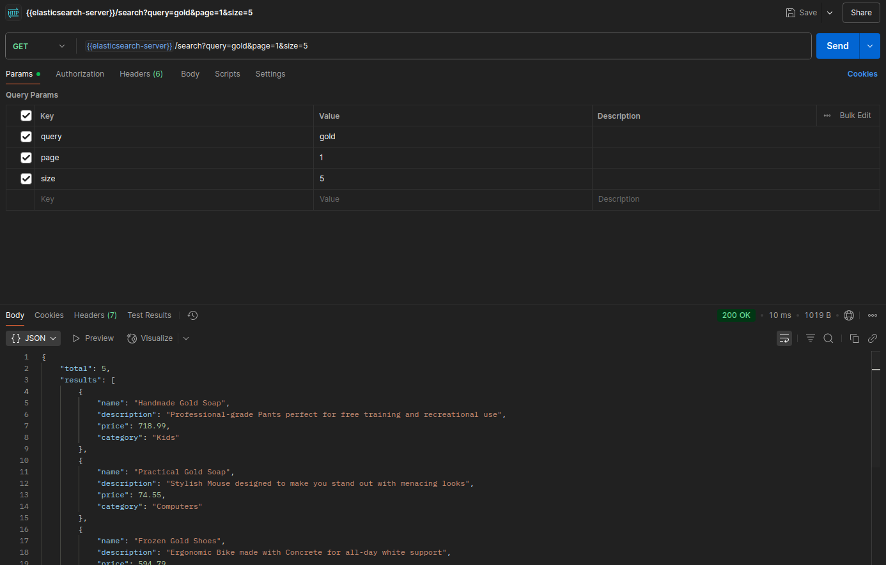

# 🧠 Elasticsearch Product Search API

This project is a simple **Product Search API** built with:

- 🟨 Node.js & Express.js
- 🟦 Elasticsearch (v8.11.3)
- 🧪 Faker.js for seeding fake product data

You can use this to learn or build on Elasticsearch search features like:
- Multi-field search (`name`, `description`, `category`)
- Fuzziness
- Pagination
- Bulk indexing

---

## 🚀 Getting Started

### 1. Clone the Repository

```bash
https://github.com/ankittiwari2001/elasticsearch-product-search.git
cd elasticsearch-product-search
````

### 2. Install Dependencies

```bash
npm install
```

---

## 🐳 Running Elasticsearch with Docker

If you don't want to install Elasticsearch locally, you can use Docker:

```bash
sudo docker run -d --name elasticsearch \
  -p 9200:9200 \
  -e "discovery.type=single-node" \
  -e "xpack.security.enabled=false" \
  elasticsearch:8.11.3
```

Test the connection:

```bash
curl http://localhost:9200
```

---

## 📦 Seed Dummy Products

This project uses `@faker-js/faker` to seed fake product data into Elasticsearch.

```bash
node seed.js
```

> ✅ This will insert 50 fake product entries into the `products` index.

---

## 🛠 Start the Server

```bash
node server.js
```

The API will be available at:
**`http://localhost:3000/search`**

---

## 🔍 Search API

### `GET /search`

Searches products across `name`, `description`, and `category` with fuzzy matching.

#### ✅ Query Parameters

| Param | Type   | Required | Description                    |
| ----- | ------ | -------- | ------------------------------ |
| query | string | No       | Search term                    |
| page  | number | No       | Page number (default: 1)       |
| size  | number | No       | Results per page (default: 10) |

#### 📦 Example Request

```http
GET /search?query=gold&page=1&size=5
```

#### 📥 Example Response

```json
{
  "total": 5,
  "results": [
    {
      "name": "Handmade Gold Soap",
      "description": "Professional-grade Pants perfect for free training and recreational use",
      "price": 18.99,
      "category": "Kids"
    },
    {
      "name": "Practical Gold Soap",
      "description": "Stylish House designed to make you stand out with menacing looks",
      "price": 74.55,
      "category": "Computers"
    }
    // ...
  ]
}
```

---

## 📁 Project Structure

```
.
├── elastic.js       # Elasticsearch client setup
├── seed.js          # Seeds 50 fake products to 'products' index
├── server.js        # Express API to search products
└── README.md
```

---

## 🧪 Testing with Postman or Thunder Client

You can use [Postman](https://www.postman.com/) to test the API:

* Method: `GET`
* URL: `http://localhost:3000/search?query=gold&page=1&size=5`

---

## ✅ Example Screenshot



---

## 🧼 Clean Up

To stop and remove the Docker container:

```bash
docker stop elasticsearch && docker rm elasticsearch
```

---

## 📜 License

MIT License — free to use and modify.

---

## 👨‍💻 Author

Built with ❤️ by \[Ankit Tiwari]

```

---
